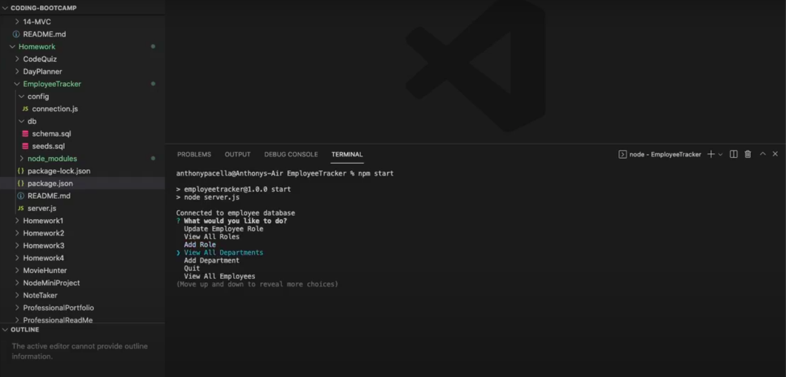

# 12 SQL: Employee Tracker

## My Task

Building a command-line application from scratch to manage a company's employee database, using Node.js, Inquirer, and MySQL.

## User Story

```md
AS A business owner
I WANT to be able to view and manage the departments, roles, and employees in my company
SO THAT I can organize and plan my business
```

## Mock-Up

The following video shows an example of the application being used from the command line:

[](https://drive.google.com/file/d/1q3icmw5-ftHoVtu2NTu8ls2Nw5yGRDq-/view?usp=sharing)

## Features

* View Features
    * View Departments
        * When chosen: a table of all company department is shown in the command line
    * View Roles
        * When chosen: a table of all company roles is shown in the command line
            * Role information displayed:
                * Role Title
                * Roles Department
                * Role Salary
    * View Employees
        * When chosen: a table of all company employees is shown in the command line
            * Employee information displayed:
                * Employee name
                * Employee Title/Role
                * Employee Department
                * Employee Salary
                * Employee Manager
* Add Features
    * Add Department
        * When chosen: user is able to input a department to add into the database
    * Add Role
        * When chosen: user is able to input a role to add to the database. When adding a role, the user will assign:
            * An associated salary of the role
            * A department for the role
    * Add Employee
        * When chosen: user is able to input a new employee into the database. When adding an employee, the user will assign:  
            * Employee Name
            * Employee Role
            * Employee Manager

* Update Feature
    * Update Employee Role
        * When chosen: user is able to update the role of an existing employee in the database. When updating a role the user will:
            * Identify the employee that the want to update the role for
            * Choose an existing role to assign to the existing employee

## Technology

* Javascript
* Node.js
* Inquirer JS
* Express
* MySQL


